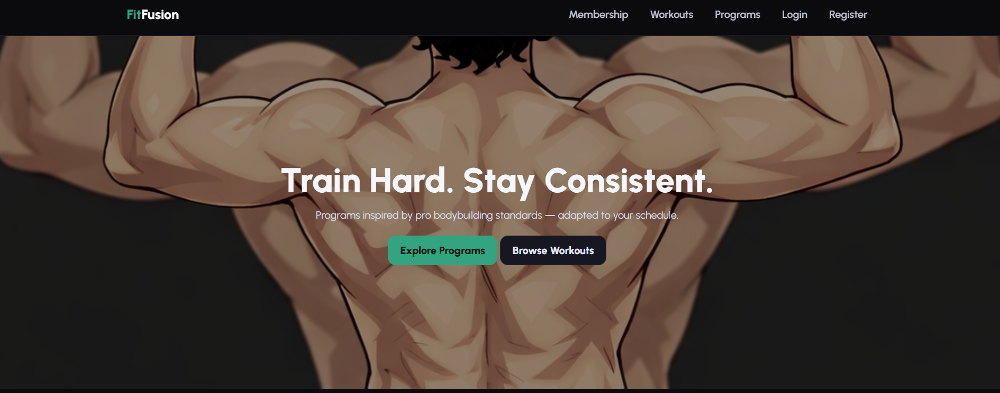
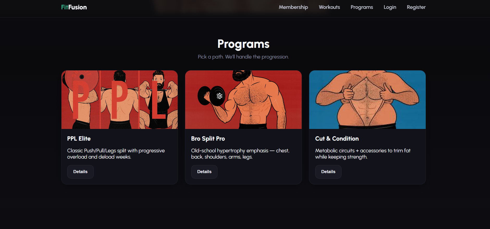
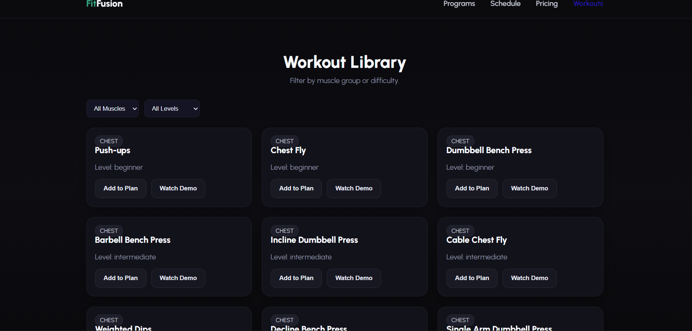

# FitFusion

FitFusion is an AI-powered fitness web application designed to help users track workouts, maintain a healthy lifestyle, and achieve fitness goals through personalized recommendations.

---

## Features

* AI-based workout recommendations
* Track daily fitness activities
* Personalized diet suggestions
* User authentication (Login & Signup)
* Fully responsive design (Mobile and Desktop)

---

## Tech Stack

* Frontend: HTML, CSS, JavaScript
* Backend: Node.js, Express.js
* Database: MongoDB
* Deployment: Render
* Version Control: Git and GitHub

---

## Screenshots

### Home 

### Programs

### Workout Library

---

## Live Demo
https://fitfusion-thg4.onrender.com/

---

## Future Enhancements

* Add AI chatbot for fitness guidance
* Integrate wearable device tracking
* Add advanced analytics dashboard

